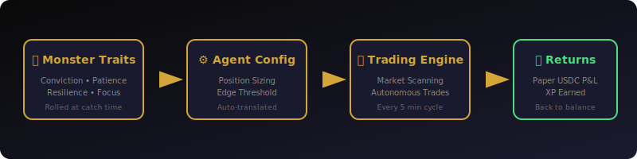

# Deployment System

This is where the monster-collecting RPG becomes a prediction market trading product. Deployment is the bridge — the exact moment your game creature becomes an autonomous trading agent.

---

## How It Works

<figure><figcaption><em>Monster Traits → Agent Config → Trading Engine → Returns</em></figcaption></figure>

**Game perspective:** You send a monster to "train" on real markets. It's gone from your party, but it's working.

**Trading perspective:** The monster's traits translate into a trading configuration. The system activates it as an autonomous agent, scanning for opportunities in its affinity markets. If edges exist, it starts trading immediately.

The existing market scanner runs every 5 minutes. When your monster is deployed, it gets picked up on the next cycle. No lag, no setup, no config screens — just gameplay into trading.

---

## Trait-to-Trading Translation

Your monster's personality directly maps to trading parameters:

| Monster Trait | Trading Parameter | How It Translates |
| --- | --- | --- |
| **Conviction** (high) | Large position sizes | Goes big when confident |
| **Conviction** (low) | Small, hedged positions | Plays it safe |
| **Patience** (high) | High edge threshold (8%+) | Only trades clear opportunities |
| **Patience** (low) | Low edge threshold (3%+) | Trades on thin edges, high frequency |
| **Resilience** (high) | Wide stop-losses | Rides through volatility |
| **Resilience** (low) | Tight stop-losses | Cuts losses fast |
| **Focus** (high) | Few concentrated positions | Big bets on best opportunities |
| **Focus** (low) | Many spread positions | Diversified across markets |

### Risk Profile Derivation

- **Conservative:** Low Conviction + High Resilience → small positions, tight risk
- **Aggressive:** High Conviction OR Low Resilience → big swings, wider exposure
- **Moderate:** Everything else

### Trading Style

- **Patient:** Patience ≥ 7 → waits for clear edge
- **Active:** Patience ≤ 3 → trades frequently on small edges
- **Balanced:** 4-6 → middle of the road

---

## Deployment XP

Monsters earn experience while deployed — they're not just sitting there:

- **Winning bet:** Moderate XP
- **Losing bet:** Small XP (you learn from losses too)

XP is applied when the monster is recalled. Deployment is an alternative leveling path alongside battling. Some players will grind battles. Some will deploy early and let their monsters learn from markets. Both work.

---

## Level = Trading Power

Higher levels don't just make monsters better at fighting. They directly improve trading capacity:

- **Higher max bet size** — more capital per position
- **Higher daily loss limit** — can sustain more drawdown
- **More market access** — secondary affinities unlock at level 10 and 20
- **Sharper traits** — every 5 levels, traits intensify

A level 5 Holdox is a cautious beginner. A level 25 Holdox is a seasoned operator with access to multiple market verticals and the capacity to make significant trades.

---

## No Notification Spam

We don't push notifications for deployments. Instead, deployment status is woven into the natural game loop:

- **The Den exterior** shows visual indicators when you walk past (green/red arrows on deployed monster portraits)
- **The Board** inside The Den shows full dashboards
- **Party menu** shows a "deployed" badge with P&L summary

You check on deployments by engaging with the world, not by being interrupted. This is intentional — the game should pull you in, not push alerts at you.

---

## The Full Picture

```
Player catches Holdox (Conviction: 8, Patience: 3, Resilience: 5, Focus: 7)
  → Battles it to level 12 (learns 4 new moves, traits sharpen)
  → Walks into The Den
  → Allocates $400 paper USDC
  → Deploys to NBA markets
  → Holdox trades as an aggressive, focused agent
    taking big positions on high-conviction NBA plays
  → Player keeps battling with other monsters
  → Checks The Board periodically: Holdox is +$47
  → Recalls Holdox for a tough trainer battle
  → $447 returns to balance
  → Holdox gained 340 XP from trading
  → Deploy again after the battle? Your call.
```

The game and the trading product aren't connected — they're the same thing.
