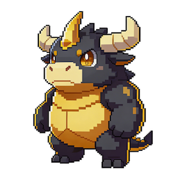
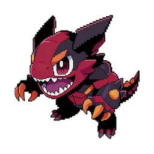
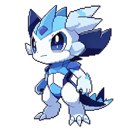
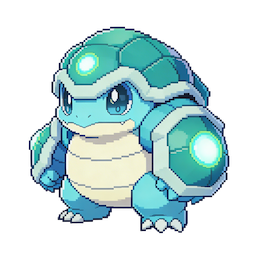
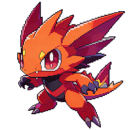

# Monster System

Five species. Each one wired different. Each one trades different.

Every monster in Roarin is backed by a real trading agent. Its species determines what markets it can trade. Its traits determine how it trades. No two monsters are the same — even within the same species.

---

## The Five Species

### Holdox — The Strategist

**Market Affinity:** Basketball / Football
**How It Trades:** Patient, high-conviction. Waits for clear edge before committing. Goes big when it sees the play.

### Ripjaw — The Maverick

**Market Affinity:** Combat / MMA
**How It Trades:** Aggressive, high-frequency. Takes smaller edges but trades often. Never sits still.

### Median — The All-Rounder

**Market Affinity:** Baseball / Hockey
**How It Trades:** Balanced risk, balanced activity. Won't make you rich overnight, won't blow up your account either.

### Shellguard — The Guardian

**Market Affinity:** Politics / Events
**How It Trades:** Conservative, capital-preservation focused. Small position sizes, tight stops. Your safe play.

### Slashburn — The Shark

**Market Affinity:** Crypto / Speculative
**How It Trades:** Momentum-following. Rides trends, cuts losers fast. High risk, high reward.

---

## Traits

Every individual monster has four randomized traits rolled at catch time. These are permanent — they define how your monster trades when deployed.

| Trait | Low | High | Trading Impact |
| --- | --- | --- | --- |
| **Conviction** | Small positions, hedges often | Goes big on high-confidence plays | Bet sizing |
| **Patience** | Trades on small edges (3%+) | Only trades on large edges (8%+) | Edge threshold |
| **Resilience** | Tight stop-losses, exits early | Wide stops, rides through volatility | Stop-loss levels |
| **Focus** | Spreads across many markets | Concentrates on fewer positions | Max open positions |

Two Holdox can play completely different. One with Conviction 8 and Patience 3 is an aggressive striker. One with Conviction 4 and Patience 9 is a calculated sniper. The hunt for perfect traits is the game within the game.

### Species Trait Averages

| Species | Conviction | Patience | Resilience | Focus |
| --- | --- | --- | --- | --- |
| Holdox | 6 | 7 | 5 | 6 |
| Ripjaw | 7 | 3 | 4 | 3 |
| Median | 5 | 5 | 5 | 5 |
| Shellguard | 3 | 6 | 7 | 7 |
| Slashburn | 8 | 4 | 3 | 4 |

---

## Market Affinity

Market affinity determines which prediction markets a monster can trade. Each species has a primary affinity with strong performance. Higher-level monsters unlock secondary affinities.

Categories include: NBA, NFL, MLB, NHL, MMA, Soccer, US Politics, Global Politics, Crypto Prices, Crypto Events, Entertainment, and Science.

New monster species = new market verticals. This creates a natural expansion model — every new zone with new species opens new markets.

---

## Leveling & Progression

- **XP Curve:** level³ — early levels come fast, later levels require real investment
- **Stat Gains:** HP and Attack increase with randomness each level
- **Move Learning:** New moves unlock at specific level thresholds
- **Affinity Expansion:** At levels 10 and 20, monsters unlock secondary market affinities
- **Trait Sharpening:** Every 5 levels, one random trait increases by 1 (capped at 10) — trained monsters become more extreme versions of themselves

Your level 1 Holdox is generic. Your level 25 Holdox is a specialist that reflects hundreds of battles of experience.
